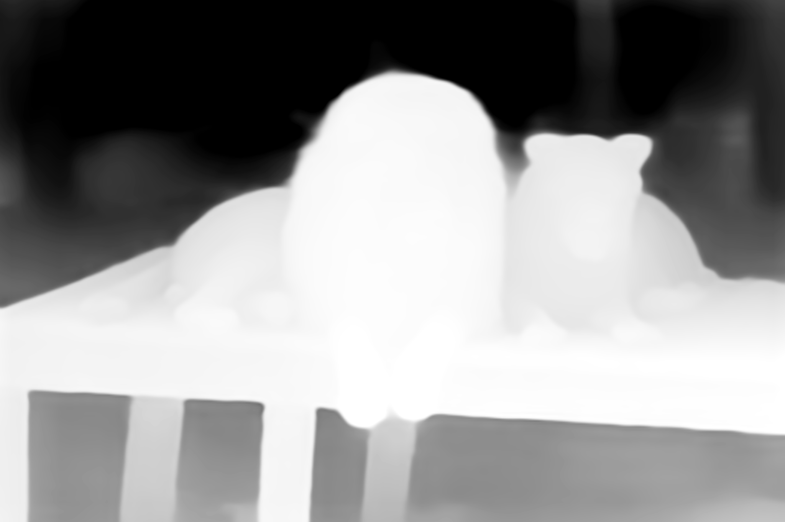

# Zoe Depth Estimation

<div style="display: flex; gap: 10px;">
    
    
</div>

This project converts 2D images into detailed depth maps using advanced machine learning and computer vision techniques. The generated depth maps provide per-pixel distance information, which is essential for applications like augmented reality, 3D scene reconstruction, and automated object detection.

Features:
- Implements state-of-the-art algorithms for single-image depth estimation.
- Facilitates the understanding of spatial structures in scenes.
- Serves as a basis for developing enhanced computer vision and AR applications.


## Usage/Examples

### CLI Usage
```bash
usage: CLI.py [-h] input_image output_image

Depth Estimation Model CLI.

positional arguments:
    input_image    Path to the input image.
    output_image   Path to the output depth map.

options:
  -h, -help        show this help message and exit
```
### API Usage
````bash
uvicorn API:app
````
API hosted at
```bash
http://127.0.0.1:8000/docs
```

## Installation

Install depth estimation requirements with pip

```bash
pip install -r requirements.txt
```
    
## Environment Variables

To run this project, add the following environment variable to your .env file:

- `API_KEY`: Visit [imgbb API](https://api.imgbb.com/) to obtain your API key.


## License

[MIT](https://choosealicense.com/licenses/mit/)

